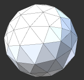
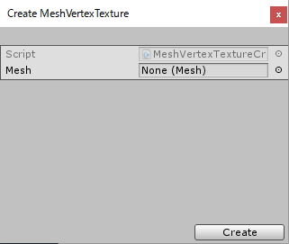

# MeshVertexTexture

Create Mesh's Vertex Texture.  
Writing Mesh vertex position data to Texture2D.  
Vertex / fragment shader or compute shader can reference vertex coordinates of the mesh.

  
**↓**  

## How to create

1. Menu [Window]->[MeshVertexTexture Creator]
2. Select Mesh  

3. Click [Create] Button
4. Create VertexTexture in Assets/MeshVertexTextures/

## How to use

Please see Sample scene.  
Assets/MeshVertexTexture/Sample/Scenes/MeshVertexTextureParticleSample.unity
